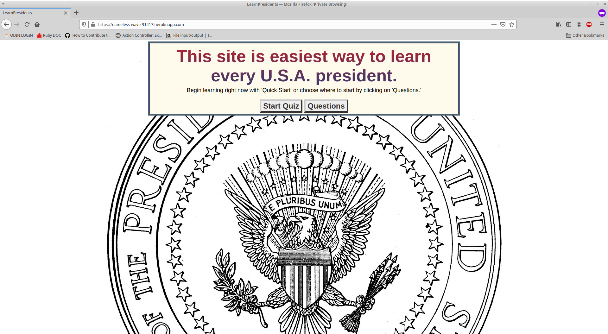
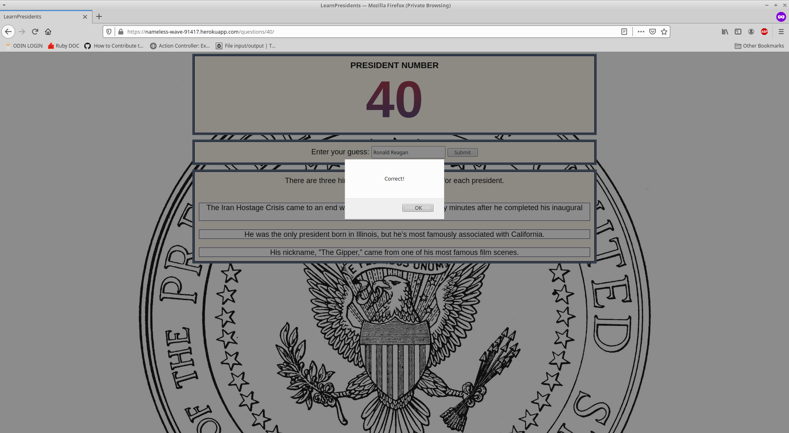

# Learn the President

## Overview

I envisioned this project as a way for students to study the chronological order of the President's of the United States.

***
## Live Demo

You can try it out [here](https://nameless-wave-91417.herokuapp.com/)  
Heroku is (in this case) a complimentary service and it may take up to sixty seconds to start a dyno on your initial launch. 
___Thank you for your patience.___


## Screenshots 






***
## Installation 

Clone the repo to your local machine: 
```ruby
$ git clone https://github.com/Kojack8/learn-presidents
```
Navigate to the directory containing that repo:
```ruby
$ cd learn-presidents/
```
Install the needed gems:
```ruby
$ bundle install
```
Install webpacker:
```
$ rails webpacker:install
```
Migrate the database:
```ruby
$ rails db:migrate
```
Finally, on root path run a local server:
```ruby
$ rails s
```
Open browser to view application:
```ruby
localhost:3000
```