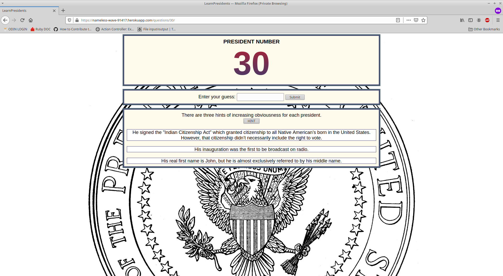

# Learn the President

## Overview

I envisioned this project as a way for students to study the chronological order of the President's of the United States and increase civic pride. Each president is listed by their numerical order and the consecutive years they served. For each question the user is afforded three hints of increasing obviousness which can be accessed with the 
press of a button. To begin learning simply press 'Start Game' on the home screen. Currently, only one answer is allowed for each question. This is an imperfect system regarding the inconsistent use of middle names and initials for various presidents. Future versions will accepted common alternatives, but for now only the most popular phrasing is accepted.

This web application was built primarily using Ruby on Rails. Information about each president is stored within a Postgres database.
Answers are checked using Javascript with the assistance of the 'Gon' gem.

***
## Live Demo

You can try it out [here](https://nameless-wave-91417.herokuapp.com/)  

The design is currently primarily built for desktop use.

Heroku is (in this case) a complimentary service and it may take up to sixty seconds to start a dyno on your initial launch. 
___Thank you for your patience.___


## Screenshots 





***
## Installation 

Clone the repo to your local machine: 
```ruby
$ git clone https://github.com/Kojack8/learn-presidents
```
Navigate to the directory containing that repo:
```ruby
$ cd learn-presidents/
```
Install the needed gems:
```ruby
$ bundle install
```
Install webpacker:
```
$ rails webpacker:install
```
Migrate the database:
```ruby
$ rails db:migrate
```
Finally, on root path run a local server:
```ruby
$ rails s
```
Open browser to view application:
```ruby
localhost:3000
```